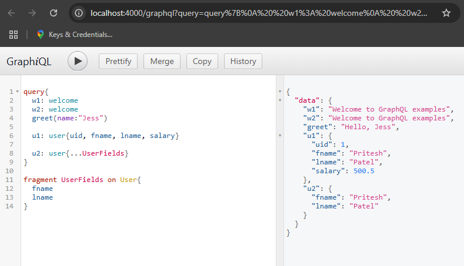
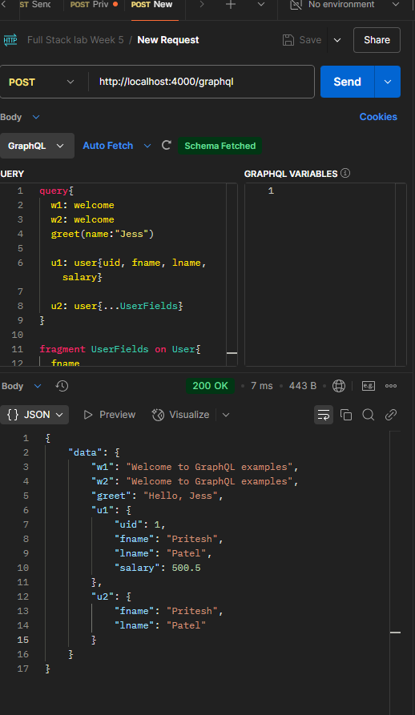
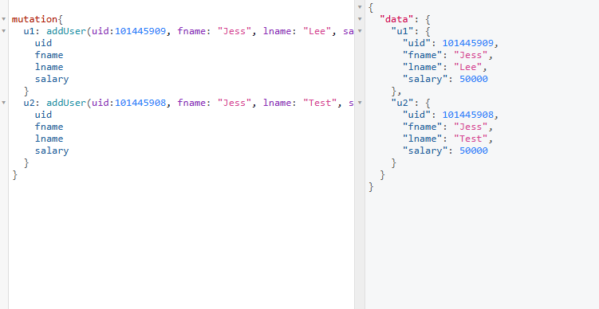
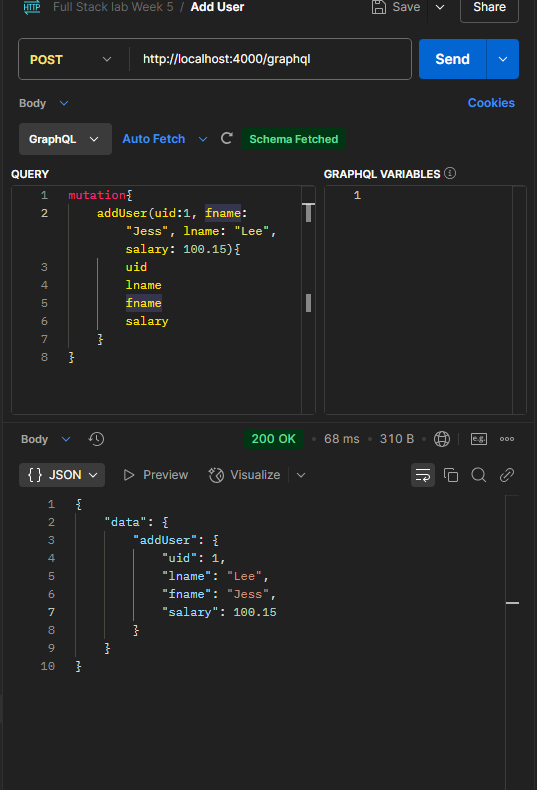

query{
 	welcome
  g1: greet(name : "Pritesh")
	g2: greet(name : "Ali")
  
   u0: user {
  	fnm
    lnm
  }
  
  u1: user {
    ...UserFields
  }
  
  u11: user {
   ...UserFields
  }
  
  u2: user{
    uid
    fnm
    lnm
    salary
  }
  
   u3: user{
    uid
    fnm
    lnm
    salary
  }
}

fragment UserFields on User{
  fnm
  lnm
}

mutations:

adding user to database through postman:
